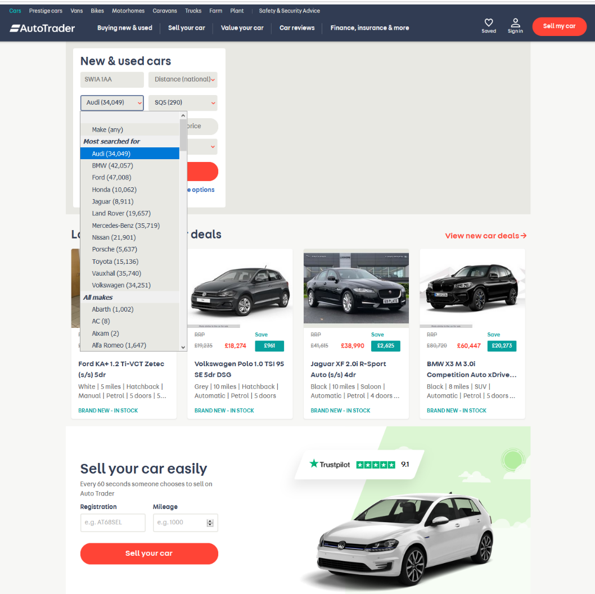
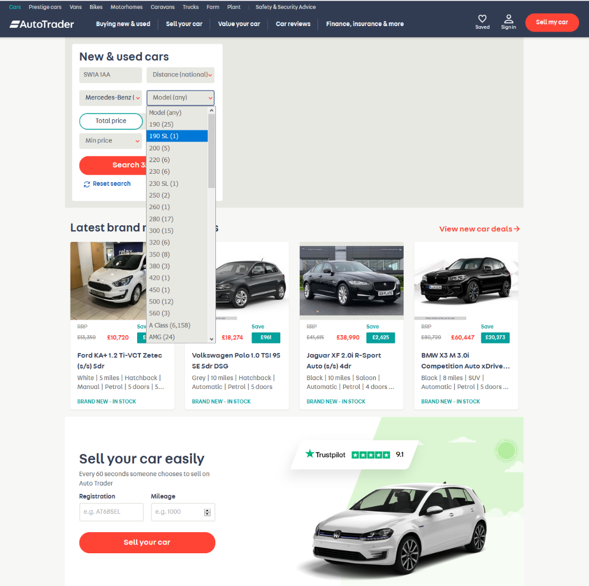
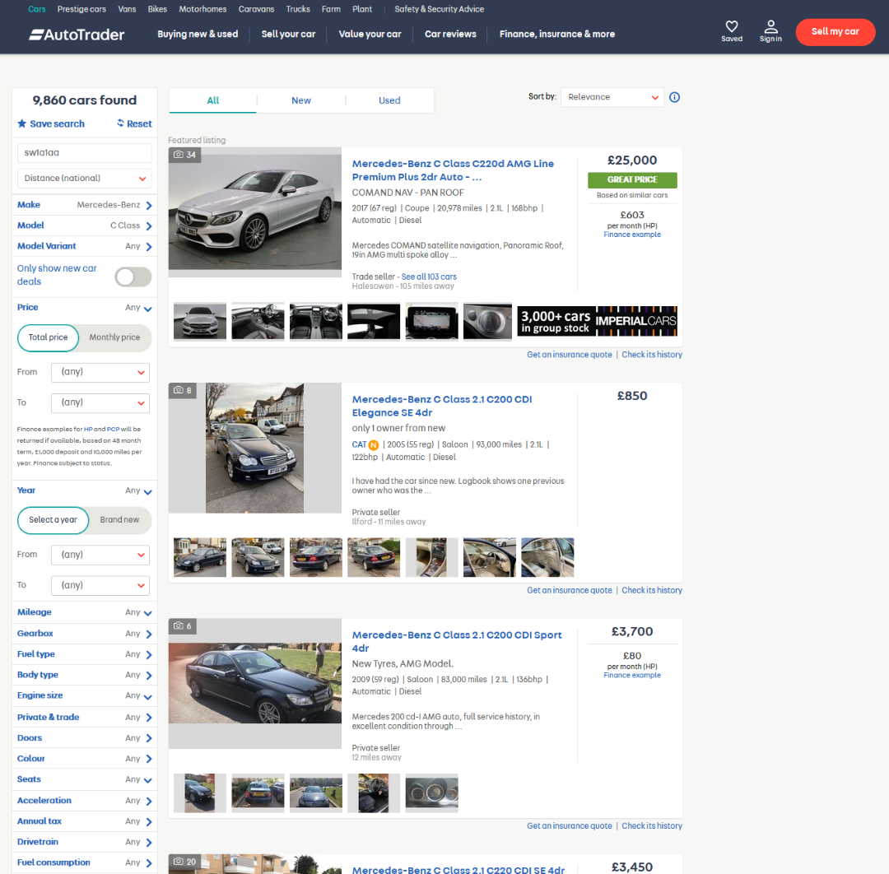

# AutoTrader Web Scraping Used Car Database
Web Scraping used to create used car database from https://www.autotrader.co.uk/ which is then dynamically visualised using a bokeh server.

Look at my other repo: https://github.com/Ben-C-Harris/AutoTrader-Used-Car-Price-Prediction to see how I've then used it to make **Used Car Predictions using Machine Learning**.

I've created a database of used cars that have been web scraped from https://www.autotrader.co.uk/ which **includes 67,249 different cars**. The web scraper could be run for longer to recieve over 500,000 used cars if required. I've then created a bokeh server application that enables you to dynamically look at the dataset as you can see in the below video: 

<p align="center"></p>

A selection of ten random rows of the dataset is as shown below:
```
      Make          Model           Name                                                                Price   Year   Miles    BHP   L   Trans     Fuel   
26935 Jeep          Grand Cherokee  Jeep Grand Cherokee 3.0 CRD V6 Overland 4x4 5dr                     5989.0  2007.0 79800.0  215.0 3.0 Automatic Diesel 
42907 Nissan        Qashqai         Nissan Qashqai 1.6 N-TEC 2WD 5dr                                    8500.0  2012.0 50000.0  113.0 1.6 Manual    Petrol 
11406 Chrysler      300C            Chrysler 300C 3.0 CRD V6 LUX 4dr                                    7495.0  2009.0 42889.0  218.0 3.0 Automatic Diesel 
2541  Audi          A4 Avant        Audi A4 AVANT TFSI SPORT 1.4 5dr                                    17200.0 2016.0 18379.0  148.0 1.4 Manual    Petrol 
63521 Volkswagen    Phaeton         Volkswagen Phaeton 3.0 TDI V6 4MOTION 4dr                           4895.0  2009.0 106000.0 237.0 3.0 Automatic Diesel 
2176  Audi          A3 Cabriolet    Audi A3 Cabriolet 1.8 TFSI Sport 2dr                                3965.0  2008.0 148082.0 158.0 1.8 Manual    Petrol 
10113 BMW           X5M             BMW X5 M 4.4 5dr                                                    54991.0 2016.0 14808.0  575.0 4.4 Automatic Petrol 
13550 Citroen       Ds3 Cabrio      Citroen DS3 CABRIO 1.6 DSPORT PLUS 3d 155 BHP * 3 MONTHS WARRANTY * 5995.0  2013.0 49000.0  153.0 1.6 Manual    Petrol 
35065 Mercedes-Benz A Class         Mercedes-Benz A Class A180 CDI Sport Edition 5dr - SAT NAV - …      12318.0 2015.0 45056.0  109.0 1.5 Manual    Diesel 
14909 Dacia         Sandero Stepway Dacia Sandero Stepway 0.9 Ambiance 5dr                              5995.0  2014.0 27000.0  90.0  0.9 Manual    Petrol 
```

# Dependencies
    requests
    json
    pandas
    BeautifulSoup
    numpy
    bokeh

# How to run
This process is run in three parts. The input and output datasets at each part are already created and shown within this repo should you wish to skip stages or go straight to the Bokeh Server application.

### Part  One ###
Part one is to find all currently listed makes and models on https://www.autotrader.co.uk/ as shown in the below photos:

<p align="center"></p>
<p align="center"></p>

This is completed through running the below script and user settings. At this point ensure your environment has all the required dependencies.

      autoTraderScrapeMakesModels.py
      
            USING_PROXY - Do you want to utilize proxy settings
            PROXY_SETTINGS - Which settings to use
            OUTPUT_PKL_FILE - Output file name


### Part  Two ###
Upon finding all the makes and models of cars on https://www.autotrader.co.uk/ using Part One, we can now search each make and model and retrieve the individual listing for as many cars as requested. This page looks like the below:

<p align="center"></p>

To do this, we run the below script and user settings:

      autoTraderUsedCarScrape.py
      
            USING_PROXY - Do you want to utilize proxy settings
            PROXY_SETTINGS - Which settings to use
            PKL_READ_FILE - Read in the Makes and Models pkl from Part One
            PKL_OUT_FILE - Output file name
            MAX_PAGE_NUM - How many search pages would you like to run through. Each page holds 12 car listings.

### Part  Three ###
Now that we have our dataset of all the car listings requested we can visualise it using bokeh. As the dataset is very large we will use a bokeh server to create dynamic plots for easier interrogation. For those of you running within an IDE upto this point, afraid this is a command line (CMD) exersise, but its really easy!

First open the .py file and ensure the input datafile is set correctly to your dataset name.

      bokehServerAutoTrader.py
      
            DATA_FILE = Input data from Part Two 

Then open a command line within the directory containing `bokehServerAutoTrader.py` and run:

      bokeh serve --show bokehServerAutoTrader.py

This will run your bokeh server and open a new tab in your browser with you new interactive plot as below:

<p align="center"></p>

Note on running Bokeh Server. I initially had issues running the server and this ended up being how I installed Anaconda and the PATH variables. So it turns out, this is pretty common. As such, ensure you have your PATH variables correctly set up as a first port of call should you encounter an issue running the above bokeh server application.


### Successful and Reliable Web Scraping through Proxy Settings  ###
Web scraping can be very difficult to do reliably and consistently. You can see within the web scraping files that there is an option for proxy settings.

You can run the web scrapers without any proxy settings however this will ultimately end up with you being denied access to the website as it knows that you are a bot and not a real human. You can impliment random pauses within the application if you wanted, but with a database retrieval of this magnitude this is also insufficient for entire extraction of data upto 500,000 individual cars.

As a result of this, the use of proxy settings is the best way to conduct large full scale web scraping with high reliability and success rate. I ultimately was able to deliver a 99.4% success rate for several hundred thousand cars well within an hour, through the use of clever proxy settings. The specifics of which I will not go into here as I wish that IP to remain my own.

But experiment as best you can I am sure you too will find some excellent results!


